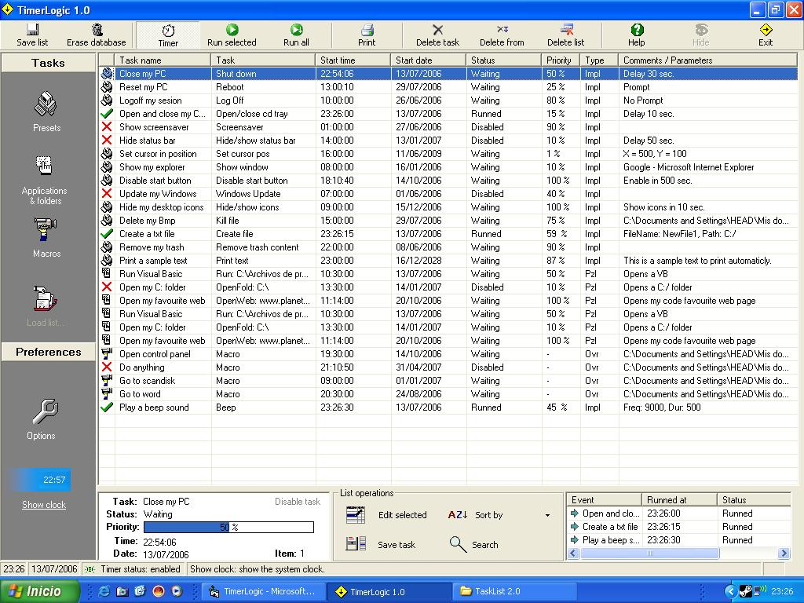



## TimerLogic 1\.0

### Description

TimerLogic 1.0 can automatize your Windows tasks, like run a program, run a preset function or play a recorded macro with mouse events and movements without your presence.
 
### More Info
 

             |
---                |---
**Submitted On**   |2006-08-19 19:27:08
**By**             |[WessySource](https://github.com/Planet-Source-Code/PSCIndex/blob/master/ByAuthor/wessysource.md)
**Level**          |Intermediate
**User Rating**    |5.0 (10 globes from 2 users)
**Compatibility**  |VB 6\.0
**Category**       |[Complete Applications](https://github.com/Planet-Source-Code/PSCIndex/blob/master/ByCategory/complete-applications__1-27.md)
**World**          |[Visual Basic](https://github.com/Planet-Source-Code/PSCIndex/blob/master/ByWorld/visual-basic.md)
**Archive File**   |[TimerLogic2054203162007\.zip](https://github.com/Planet-Source-Code/wessysource-timerlogic-1-0__1-68150/archive/master.zip)

